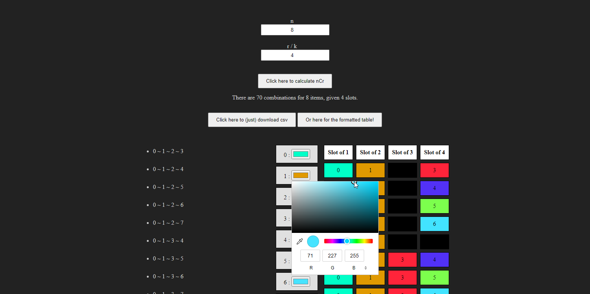
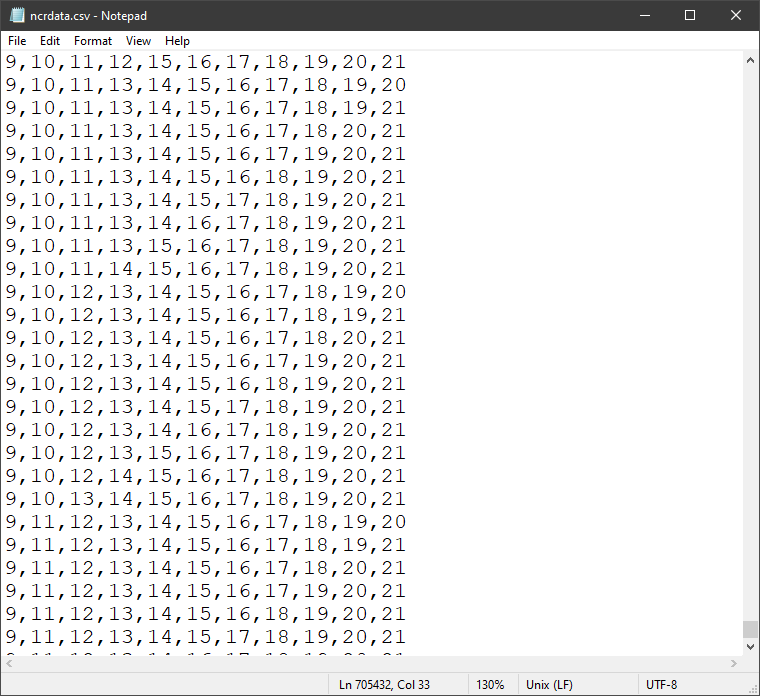
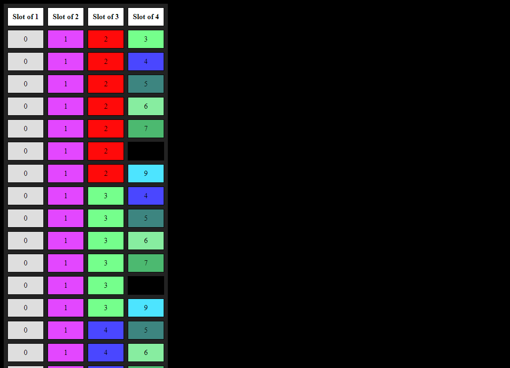

# nCr-Combinations-Vizualizer
A Javascript (and a little ES6) Client-Sided Tool to Generate and Visualize nCr (Combinations) Mathematically using Array.
[Live Preview Here ( w/ github.com/htmlpreview )](https://htmlpreview.github.io/?https://github.com/jxxvxs/nCr-Combinations-Vizualizer/blob/main/index.html)

# References
* ### [Maximux Size of an Array](https://stackoverflow.com/questions/6154989/maximum-size-of-an-array-in-javascript)
* ### [Generating nCr with ***combinations.js***](https://gist.github.com/axelpale/3118596)
* ### [Random color to Vizualise Items](http://jsfiddle.net/tWyq6/27/)
* ### [Converting Array to Unordered-List](https://getbutterfly.com/generate-html-list-from-javascript-array/)
* ### [Downloading CSV from Array Object](https://stackoverflow.com/questions/18848860/javascript-array-to-csv)
* ### [Creating Array with ES6](https://stackoverflow.com/questions/39924644/es6-generate-an-array-of-numbers)

# Screenshot

* ### Preview

* ### Generated CSV
It's possible to generate 705432 rows of data, and possibly more depends on your Browser and Device used.

* ### Generated Table

